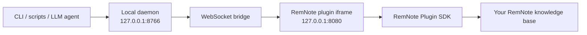

# RemNoteConnect

RemNoteConnect is local-first RemNote automation for learning workflows, with an LLM-friendly CLI.

It lets terminal tools, scripts, and LLM agents work with your RemNote knowledge base through a small HTTP API and CLI. It is built for people who use RemNote as a learning system: capture notes, connect ideas, clean up messy imports, create flashcards, and review knowledge faster without giving a cloud service direct control of your database.

> Status: experimental local-first tooling. It is MIT open source, but the npm package is intentionally marked `"private": true` because npm distribution is not supported yet. It is not affiliated with RemNote.

## Why This Exists

RemNote is powerful for learning because it combines an outliner, knowledge graph, spaced repetition, and flashcards. The missing piece is a fast local control surface that an assistant can use safely.

RemNoteConnect gives you that surface:

- Read and map your RemNote graph from the terminal.
- Create documents and flashcards from notes, articles, books, lectures, or research.
- Search, audit, and clean up duplicate or low-quality Rem.
- Run bulk operations behind dry-run and exact-count approval gates.
- Keep a local read/write boundary: the daemon is on `127.0.0.1`, protected by a local token.

The goal is not to replace RemNote. The goal is to make RemNote easier to operate when you are learning quickly across many domains.

## What You Can Do With It

### Learn Any Topic Faster

Use RemNoteConnect to build a repeatable learning loop:

1. Capture raw material into RemNote.
2. Ask an LLM to extract atomic concepts.
3. Turn the best concepts into RemNote-native flashcards.
4. Link new ideas to existing Rem.
5. Audit weak cards, duplicates, orphan notes, and empty placeholders.
6. Keep the graph clean enough that review and search stay useful.

Good use cases:

- Build a study guide from a textbook chapter.
- Convert lecture notes into linked concepts and cards.
- Generate flashcards only after you approve the source notes.
- Find related ideas before writing an essay or research memo.
- Keep a “learning cockpit” for progress across domains.

### Control RemNote From Any LLM

The primary interface is CLI-first:

```sh
node scripts/rnc.mjs status
node scripts/rnc.mjs readonly on
node scripts/rnc.mjs map --depth 3
node scripts/rnc.mjs search 'text:mitochondria'
node scripts/rnc.mjs create-document --md ./notes.md --parent "Biology" --confirm
```

Because the CLI is plain shell, it can be used by Codex, Claude Code, Cursor agents, local scripts, cron jobs, or any future tool that can run commands.

## Architecture



RemNote does not expose a general backend API for this use case, so writes happen through a RemNote frontend plugin. The local daemon handles auth, request validation, safety gates, job state, backups, and CLI/API ergonomics.

## Safety Model

RemNoteConnect can request whole-knowledge-base access, so the safety model is explicit:

- The daemon binds to `127.0.0.1`.
- Every HTTP request requires a bearer token stored in your local app-support directory.
- Mutating actions are blocked while `readonly` mode is on.
- Destructive and bulk operations are dry-run-first.
- Large operations require exact `confirmCount` approval.
- Soft delete moves Rem into `RemNoteConnect/Trash/<opId>` instead of hard-deleting.
- `emptyTrash` is the only hard-delete path.
- Snapshot restore is treated as disaster recovery, not true undo, because restored Rem get new IDs.

Read [docs/INVARIANTS.md](docs/INVARIANTS.md) before using this against a real knowledge base.

## Quickstart

Before installing, understand the permission model: RemNoteConnect can request whole-knowledge-base access from RemNote desktop. Start in read-only mode, use dry-runs before broad cleanup, and read [docs/SAFE_USAGE.md](docs/SAFE_USAGE.md) before running writes against a real graph.

Requirements:

- macOS
- RemNote desktop
- Node.js
- `pnpm`

Install:

```sh
git clone https://github.com/lucaschatham/remnoteconnect.git
cd remnoteconnect
npx pnpm@11.7.0 install
npx pnpm@11.7.0 build
```

Start the local daemon:

```sh
npx pnpm@11.7.0 --filter @remnoteconnect/daemon start
```

The daemon serves the plugin bundle at:

```text
http://127.0.0.1:8080
```

In RemNote desktop:

1. Open Plugins.
2. Go to Build.
3. Choose “Develop from localhost”.
4. Enter `http://127.0.0.1:8080`.
5. Approve the requested permissions.

Print the local daemon token and paste it into the plugin settings:

```sh
npx pnpm@11.7.0 token:unsafe
```

Then verify:

```sh
node scripts/rnc.mjs doctor
node scripts/rnc.mjs status
```

For daily use, install the LaunchAgent:

```sh
npx pnpm@11.7.0 launch-agent:install
```

## API Shape

RemNoteConnect exposes a native action API:

```json
{
  "action": "createFlashcard",
  "version": 1,
  "params": {
    "deckPath": "Biology/Cellular Respiration",
    "front": "What does ATP synthase do?",
    "back": "It uses the proton gradient to synthesize ATP from ADP and phosphate.",
    "tags": ["biology", "energy-metabolism"]
  }
}
```

It also includes an AnkiConnect-inspired adapter for familiar workflows:

- `addNote`
- `addNotes`
- `canAddNote`
- `findNotes`
- `notesInfo`
- `deckNames`
- `createDeck`
- `changeDeck`

This is workflow parity, not literal Anki compatibility. Anki-specific model, template, scheduler, and `.apkg` actions return stable unsupported errors.

## Core Actions

Common native actions:

- `status`, `doctor`, `describe`, `capabilities`, `readonly`
- `map`, `getRem`, `searchGraph`, `findByTag`
- `createDocument`, `getDocument`, `appendToDocument`
- `createFlashcard`, `createFlashcards`, `updateFlashcard`, `searchFlashcards`
- `renameRem`, `moveRem`, `deleteRem`, `bulkMove`, `bulkDelete`
- `findDuplicates`, `findEmpty`, `findOrphans`, `normalizeText`
- `backupGraph`, `journalTail`, `undo`, `listTombstones`, `emptyTrash`

Run:

```sh
node scripts/rnc.mjs describe
```

to inspect the available action metadata from your local build.

## Learning Workflows

See [docs/LEARNING_WORKFLOWS.md](docs/LEARNING_WORKFLOWS.md) for practical patterns:

- reading a book
- studying a technical topic
- creating atomic flashcards
- cleaning up a messy graph
- using RemNoteConnect with an LLM agent

## Maturity

Stable in v0.3:

- local daemon and RemNote plugin bridge
- CLI and HTTP action envelope
- read-only mode, dry-runs, and exact-count approval guards
- basic document, flashcard, search, map, and cleanup workflows

Experimental in v0.3:

- image occlusion and advanced media workflows
- scheduler mutation
- semantic search sidecars
- RemNote marketplace packaging
- cross-platform packaging beyond local Mac usage

## Verification

Static checks:

```sh
npx pnpm@11.7.0 -r typecheck
npx pnpm@11.7.0 --filter @remnoteconnect/plugin test
npx pnpm@11.7.0 --filter @remnoteconnect/daemon test
npx pnpm@11.7.0 -r build
npx pnpm@11.7.0 check:no-token
npx pnpm@11.7.0 check:redteam
```

Live checks require RemNote desktop with the local plugin connected:

```sh
node scripts/live-security.mjs
node scripts/live-readonly.mjs
node scripts/live-scope.mjs
node scripts/live-softdelete.mjs
node scripts/live-docs.mjs
node scripts/live-cleanup.mjs
node scripts/live-idempotent.mjs
```

## Public Repo Checklist

Before pushing a public repo, read [docs/PUBLICATION_CHECKLIST.md](docs/PUBLICATION_CHECKLIST.md).

In particular, do not publish:

- daemon tokens
- local app-support files
- private RemNote exports
- Obsidian migration reports
- generated audit JSON containing personal note titles or snippets

## Limitations

- This is local-first Mac tooling today.
- The RemNote plugin must be loaded and connected for RemNote reads/writes.
- Mobile RemNote apps do not run this local desktop bridge.
- Whole-graph operations require care. Use `readonly on`, dry-runs, and exact-count approvals.
- Some RemNote features depend on what the Plugin SDK exposes.
- Image occlusion and advanced media workflows should be treated as experimental until verified against your RemNote version.

## More Docs

- [Safe usage](docs/SAFE_USAGE.md)
- [Threat model](docs/THREAT_MODEL.md)
- [Troubleshooting](docs/TROUBLESHOOTING.md)
- [Roadmap](docs/ROADMAP.md)

## License

MIT. See [LICENSE](LICENSE).
