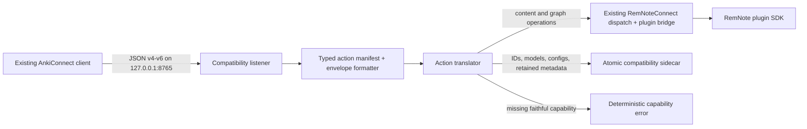
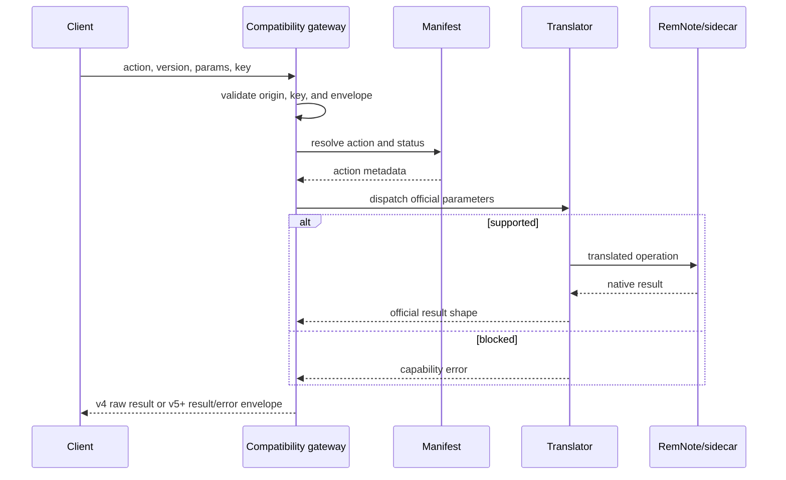
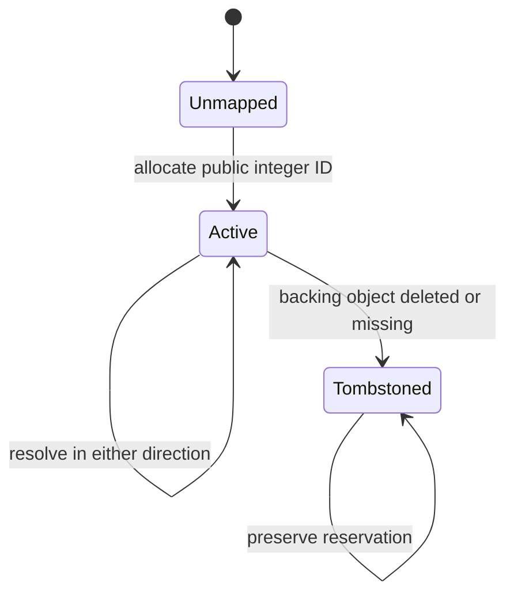

# feat: Add AnkiConnect API compatibility mode

## Summary

Add a clean-room AnkiConnect v6 compatibility listener alongside the native RemNoteConnect API. The implementation will recognize the complete pinned public action surface, reproduce the wire contract, translate shared note/card/deck/tag/media/model behavior onto RemNote, and fail deterministically for Anki-only capabilities rather than return false success.

---

## Problem Frame

RemNoteConnect exposes nine AnkiConnect-inspired aliases but explicitly does not provide literal compatibility. Existing AnkiConnect clients expect port 8765, a different authentication model, string errors, legacy response handling, integer identifiers, official parameter/result schemas, and 122 public actions. Extending the current aliases ad hoc would mix two public contracts and make both less reliable.

The compatibility layer must preserve the native API, safety gates, and plugin bridge while treating the pinned AnkiConnect interface as an independent external contract.

---

## Requirements

- **R1 — Complete action registry:** Represent all 122 official actions from the pinned upstream commit in one typed manifest with family, mutation, implementation status, and limitation metadata.
- **R2 — Exact envelope:** Match AnkiConnect v6 request defaults, v5+ success/error envelopes, v4 success behavior, API-key checks, and `multi` ordering.
- **R3 — Separate listener:** Serve the compatibility contract at loopback port 8765 only when explicitly enabled; leave the native port 8766 contract unchanged.
- **R4 — Persistent integer IDs:** Translate RemNote string IDs to stable positive safe integers for notes, cards, decks, models, and configs, including restart and tombstone behavior.
- **R5 — Shared-domain behavior:** Implement note, card lookup, deck, tag, media, and model-metadata actions through RemNote or an explicit sidecar.
- **R6 — Capability honesty:** Recognize blocked scheduler, review-log, profile, package, and GUI actions and return stable string errors without mutation.
- **R7 — Safety:** Enforce loopback/origin rules, compatibility opt-in, API-key behavior, native read-only mode, media boundaries, auditability, and secret redaction.
- **R8 — Native isolation:** Do not change native RemNoteConnect request, response, authentication, or safety semantics.
- **R9 — Generated truth:** Generate the compatibility report/documentation from the same manifest used for dispatch and tests.
- **R10 — Contract verification:** Test every action’s registry presence and every implemented family’s official request/result shape using fakes only.
- **R11 — Performance:** Measure gateway overhead and sidecar scale independently; keep p95 warm-read translation below 10 ms and 10,000-identity append below 40 ms in fake-backed tests.
- **R12 — Clean-room licensing:** Record the upstream commit used for interface research and copy no GPL implementation code.

---

## Key Technical Decisions

1. **Add a sibling compatibility server, not aliases on the native endpoint.** This permits the default AnkiConnect port and envelope without weakening the native bearer-token API or changing native errors.
2. **Use a single typed manifest as the action authority.** Runtime routing, `apiReflect`, completeness tests, and the compatibility matrix derive from it, preventing action drift.
3. **Classify behavior as native, translated, sidecar, or blocked.** This makes semantic differences testable and prevents “recognized” from being misreported as “implemented.”
4. **Persist only compatibility metadata.** RemNote remains authoritative for content and review behavior; the sidecar stores IDs, models/templates, deck config, retained field metadata, and media indexes that RemNote cannot express.
5. **Never simulate the Anki scheduler.** Observable RemNote card state may be returned, but Anki-specific scheduling writes and review history stay blocked until the SDK provides a proven equivalent.
6. **Compatibility writes require two explicit gates.** The listener must be enabled and native read-only mode must be off. Once both gates pass, Anki mutation calls execute directly because the official API has no dry-run handshake.

---

## High-Level Technical Design

---

## Scope Boundaries

### In scope

- Official action manifest and compatibility matrix
- Independent port-8765 compatibility listener
- Envelope, authentication, CORS, `multi`, and `apiReflect`
- Persistent identity and metadata sidecar
- RemNote translations for shared note/card/deck/tag/media/model concepts
- Deterministic blocked behavior for non-transferable Anki features
- Automated contract, integration, security, and performance checks

### Outside this increment

- A faithful Anki/FSRS scheduler implementation
- Desktop GUI automation against the RemNote application
- Binary APKG compatibility without an independent MIT-compatible parser
- Production writes against the user’s personal RemNote graph during testing

### Deferred to Follow-Up Work

- Expanding support when future RemNote SDK versions expose scheduler or GUI capabilities
- A migration assistant that rewrites third-party client configuration automatically
- Published client-language conformance fixtures

---

## Implementation Units

### U1. Pin and encode the public contract

**Goal:** Create the complete typed action manifest and compatibility reporting primitives.

**Requirements:** R1, R6, R9, R12

**Dependencies:** None

**Files:**

- `shared/src/ankiConnect.ts`
- `shared/src/index.ts`
- `shared/test/ankiConnect.test.ts`
- `docs/ANKICONNECT_COMPATIBILITY.md`

**Approach:** Independently encode the 122 public names from the pinned official source and annotate each action by family, mutation, implementation status, and limitation. Export request/result types and generate the user-facing matrix from manifest data.

**Execution note:** Begin with a completeness test that compares the expected pinned names and count before adding routing behavior.

**Patterns to follow:** Existing shared action metadata and Zod envelope definitions.

**Test scenarios:**

- The manifest contains exactly 122 unique names and the known first/last actions.
- Every action includes a family, mutation flag, status, and non-empty summary.
- Every blocked action includes non-empty capability limitation text.
- Generated report rows equal manifest rows and retain the pinned source commit.

**Verification:** A reviewer can identify the declared status of every official action from one generated artifact, and tests fail on any missing, duplicate, or unclassified action.

### U2. Add the protocol-compatible gateway

**Goal:** Reproduce the AnkiConnect transport, envelope, version, API-key, CORS, reflection, and batching contract without altering the native server.

**Requirements:** R2, R3, R7, R8

**Dependencies:** U1

**Files:**

- `daemon/src/ankiCompatServer.ts`
- `daemon/src/config.ts`
- `daemon/src/index.ts`
- `daemon/src/server.ts`
- `daemon/test/ankiCompatServer.test.ts`

**Approach:** Create a sibling Fastify listener sharing the existing bridge/runtime but with independent hooks and response formatting. Default it off, bind it to loopback port 8765 when enabled, and implement gateway-local actions plus recursive `multi` with no native batching limits that differ from the official contract.

**Execution note:** Start with request/response characterization tests derived from the official v4/v6 behavior.

**Patterns to follow:** Existing server injection tests, host/origin validation, and constant-time token comparison.

**Test scenarios:**

- Version 6 `version` returns `{result: 6, error: null}` and version 4 returns raw `6`.
- Unsupported and thrown actions return HTTP 200 with a string error and null result.
- Missing/wrong API keys fail when configured and are accepted when no key is configured.
- `multi` preserves order, permits per-item versions, and contains one nested envelope per input.
- Native root requests still require the bearer token and retain structured native errors.
- The compatibility listener rejects non-loopback hosts and disallowed browser origins.

**Verification:** Unmodified AnkiConnect request fixtures pass against the compatibility app while all existing native server tests remain unchanged.

### U3. Build persistent compatibility identity and metadata

**Goal:** Provide restart-safe integer identities and sidecar persistence for concepts RemNote cannot store directly.

**Requirements:** R4, R5, R7

**Dependencies:** U1

**Files:**

- `daemon/src/ankiCompatStore.ts`
- `daemon/test/ankiCompatStore.test.ts`

**Approach:** Use an atomic versioned JSON sidecar under the daemon app directory with serialized writes, monotonic safe-integer allocation, reverse indexes, tombstones, models, deck configs, note metadata, and media metadata. Treat RemNote content as external references, never duplicate it as canonical content.

**Execution note:** Implement ID allocation and corruption handling test-first because identity reuse would be destructive.

**Test scenarios:**

- Concurrent allocation for the same external ID returns one public ID.
- Different entity kinds and external IDs never collide within their public namespace.
- Mappings and metadata survive a new store instance.
- Tombstoned IDs never resolve to a newly allocated object or get reused.
- A malformed or unsupported sidecar version fails closed without overwriting the file.
- Atomic writes leave either the previous or next valid document after a simulated replacement failure.

**Verification:** Identity and sidecar tests prove stable bidirectional mappings across restart and safe behavior under concurrency and corruption.

### U4. Translate shared note, card, deck, and tag behavior

**Goal:** Make the highest-value AnkiConnect workflows operate faithfully on RemNote content.

**Requirements:** R4, R5, R6, R7, R8

**Dependencies:** U2, U3

**Files:**

- `daemon/src/ankiCompatDispatcher.ts`
- `plugin/src/executor.ts`
- `plugin/src/remnoteHelpers.ts`
- `daemon/test/ankiCompatDispatcher.test.ts`
- `plugin/test/executor.test.ts`

**Approach:** Translate official parameters into existing native operations, add narrowly scoped plugin reads/mutations where official result fields require data unavailable to current aliases, map IDs through the sidecar, and return official primitive/object shapes. Direct compatibility mutations still use existing bridge auditing/undo preparation where possible and remain blocked by read-only mode.

**Execution note:** Add contract tests for each action family before changing plugin execution.

**Test scenarios:**

- Basic and cloze note creation returns integer note IDs and preserves deck, tags, fields, and media references.
- Note lookup/info/update/tag/delete actions accept integer IDs and return official fields/types.
- Card lookup/info and cards-to-notes maintain distinct stable card and note IDs.
- Deck creation/listing/ID lookup/change/delete translates `::` hierarchy correctly.
- Query translation covers deck, tag, note ID, card ID, and free-text clauses without silently broadening unsupported syntax.
- Read-only mode blocks every mutation with an AnkiConnect string error and no plugin job.
- Missing and stale mappings return not-found errors rather than allocating replacement identities.

**Verification:** A fake RemNote graph completes an end-to-end create → query → inspect → tag → move → delete workflow through official AnkiConnect shapes.

### U5. Implement model, configuration, and media sidecars

**Goal:** Support AnkiConnect workflows whose metadata has no direct RemNote representation but can be preserved safely and honestly.

**Requirements:** R5, R7, R8

**Dependencies:** U2, U3, U4

**Files:**

- `daemon/src/ankiCompatDispatcher.ts`
- `daemon/src/ankiCompatMedia.ts`
- `daemon/test/ankiCompatModels.test.ts`
- `daemon/test/ankiCompatMedia.test.ts`

**Approach:** Implement models/templates/styling and deck configurations in the versioned sidecar, bootstrap Basic/Cloze defaults, and implement bounded local media storage with official action shapes. Note creation consumes model definitions and retains field metadata while RemNote remains canonical for visible content.

**Test scenarios:**

- Model create/read/update/rename/reposition/add/remove actions round-trip official fields and errors.
- Basic and Cloze defaults have stable IDs and survive restart.
- Deck config clone/save/assign/remove actions retain integer identities and reject invalid references.
- Media base64 store/retrieve/list/delete round-trips bytes and official filenames.
- Path traversal, oversized data, unsupported URL schemes, timeouts, and invalid filenames fail without filesystem escape.
- Note media directives store files before content mutation and report partial failures without false success.

**Verification:** Model, config, and media conformance fixtures pass with no real RemNote data or arbitrary filesystem access.

### U6. Enforce capability boundaries for Anki-only behavior

**Goal:** Complete 122-action routing while keeping unsupported semantics explicit and non-mutating.

**Requirements:** R1, R6, R9, R10

**Dependencies:** U2, U4, U5

**Files:**

- `daemon/src/ankiCompatDispatcher.ts`
- `daemon/test/ankiCompatCapabilities.test.ts`
- `docs/ANKICONNECT_COMPATIBILITY.md`

**Approach:** Route every remaining action through the manifest. Implement harmless collection/profile compatibility where an exact single-profile result is possible; block scheduler writes, unavailable review logs, desktop GUI actions, and package operations with stable capability messages. Generate documentation from observed routing status.

**Test scenarios:**

- Dispatching every manifest action yields either an official-shaped result or the action’s declared capability error, never “unknown action.”
- Every blocked action makes zero bridge calls and leaves the sidecar byte-for-byte unchanged.
- `apiReflect` returns all requested valid actions and excludes invalid names.
- The generated matrix matches runtime status for all 122 actions.

**Verification:** An exhaustive test proves complete routing and no false-success path for blocked capabilities.

### U7. Validate performance, security, and operator documentation

**Goal:** Prove the compatibility mode is fast, opt-in, locally constrained, and operable.

**Requirements:** R3, R7, R10, R11, R12

**Dependencies:** U2, U3, U4, U5, U6

**Files:**

- `scripts/bench-anki-compat.mjs`
- `scripts/check-anki-contract.mjs`
- `README.md`
- `docs/SAFE_USAGE.md`
- `docs/ANKICONNECT_COMPATIBILITY.md`
- `package.json`

**Approach:** Add fake-backed gateway and translation benchmarks, contract drift checks, setup instructions, safety warnings, API-key configuration, limitation guidance, and clean-room attribution. Keep live writes out of the default verification path.

**Test scenarios:**

- Gateway-only and mocked translation paths meet their p95 overhead budgets.
- Static scans find no token/API-key values in logs or generated artifacts.
- Startup clearly reports whether the compatibility listener is enabled and where it is bound.
- Contract check detects a missing, duplicate, or renamed action.
- All workspace tests, typechecks, and production builds pass with compatibility mode both off and enabled.

**Verification:** The documented local setup starts safely, the contract and security checks pass, and benchmark output reports percentile evidence for the stated performance objectives.

---

## System-Wide Impact

- **Users:** Existing AnkiConnect clients gain a drop-in local endpoint for shared behaviors, with explicit errors for Anki-only features.
- **Native API clients:** No contract change; compatibility runs on a sibling listener and retains native authentication.
- **Plugin:** Gains targeted data access for official result shapes but no independent network surface.
- **Operations:** One optional local port and one versioned sidecar are added; startup and backups must account for both.
- **Security:** Enabling Anki-style direct mutations is an explicit trust decision and remains subordinate to native read-only mode.

---

## Risks and Mitigations

- **False parity claims:** Separate action recognition, schema parity, and semantic parity; generate status from runtime metadata.
- **ID corruption or reuse:** Serialize allocation, atomically replace the sidecar, preserve tombstones, and fail closed on version/corruption errors.
- **Query mismatch:** Support a documented subset translation and reject unsupported clauses rather than broaden them.
- **Scheduler divergence:** Do not maintain a shadow scheduler; block actions lacking a proven SDK equivalent.
- **Safety regression:** Keep compatibility on a separate opt-in listener and enforce native read-only mode before mutations.
- **GPL contamination:** Use the official project only to identify public interface facts; independently author TypeScript and retain source/commit attribution.
- **Performance masked by RemNote latency:** Benchmark gateway overhead and SDK execution separately.

---

## Success Metrics

- 122/122 official actions are registered and exhaustively routed.
- 100% of blocked actions return their declared capability error with no mutation.
- 100% of native API regression tests pass unchanged.
- Gateway warm-read translation overhead p95 is below 10 ms and 10,000-identity append p95 is below 40 ms in fake-backed tests.
- Zero public-ID collisions or reuse in concurrency and restart tests.
- Zero secrets or note/card contents in compatibility logs.

---

## Sources and Research

- [Official AnkiConnect repository](https://git.sr.ht/~foosoft/anki-connect), interface pinned to commit `de6e6e1b8aaf4ae195eb1d1ff6db5409b99b2a3e`.
- Local RemNoteConnect v0.4 action metadata, server dispatch, plugin executor, bridge, safety coordinator, and existing Anki-inspired aliases.

The upstream research is load-bearing: it defines the 122-action contract, legacy envelope behavior, default port, key behavior, and `multi` semantics. No upstream implementation code is incorporated.
